# 모힘: 모이기를 힘쓰라

> 교회 일정 자동 동기화 및 공유 캘린더 서비스

 

## 목차

- [프로젝트 배경](#프로젝트-배경)
- [기술 스택](#기술-스택)
- [애플리케이션 구조](#애플리케이션-구조)
- [서버](#서버)
- [구현 기능](#구현-기능)
- [스크린샷](#스크린샷)
- [데모 영상](#데모-영상)

---

## 프로젝트 배경

**<모힘: 모이기를 힘쓰라>는 교회 성도님들을 위한 교회 일정 자동 동기화 및 공유 캘린더 서비스이다.** 교회 안에는 다양한 소그룹들이 존재한다. 나이, 성별에 따라서 소속 그룹이 나누어지며, 봉사 부서별로도 나누어진다. 공통되는 일정 외에도 그룹별로 일정들이 다양하기 때문에, 일정 관리에 어려움(어려움까진 아니더라도 불편함)을 겪는 분들이 많이 계신다. 더구나 코로나로 인해 일정들이 자주 변경되어 일정 관리가 더욱 어려워졌다. 이러한 성도님들의 어려움을 돕기 위해 이 프로젝트를 시작하게 되었다.

---

## 기술 스택

    

---

## 애플리케이션 구조

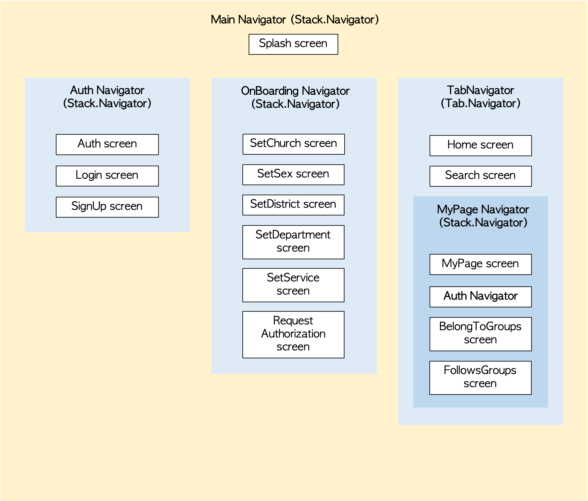

---

## 서버

[서버에 대한 설명은 여기로! 👈🏻](https://github.com/hngyb/mohim-back)

---

## 구현 기능

- [x] 사용자 인증
- [x] 소속 및 팔로우 그룹에 따른 교회 일정 자동 동기화
- [x] 그룹 검색 기능
- [x] 소속 그룹 및 팔로우 그룹 수정 기능
- [x] 그룹 색상 변경
- [ ] 사용자 개인 일정 추가 기능
- [ ] 그룹 관리자 기능
- [ ] 사용자 그룹 생성 및 초대 기능

---

## 스크린샷

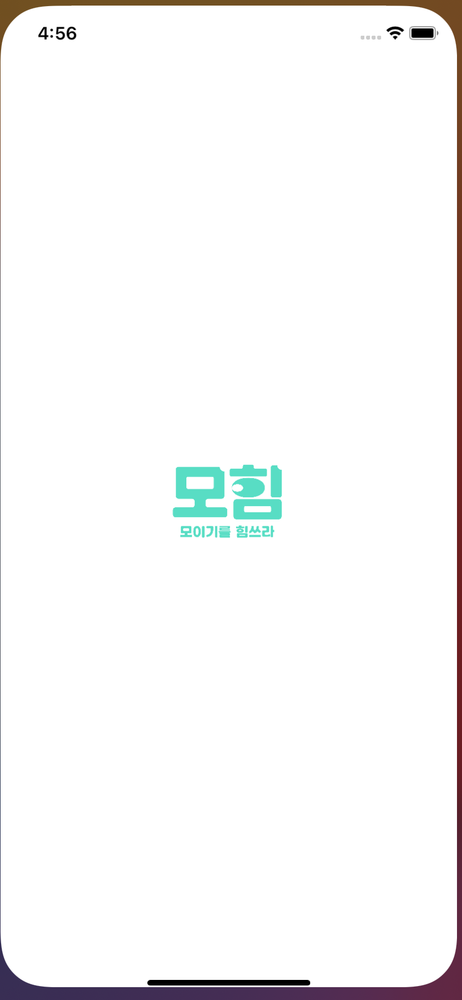
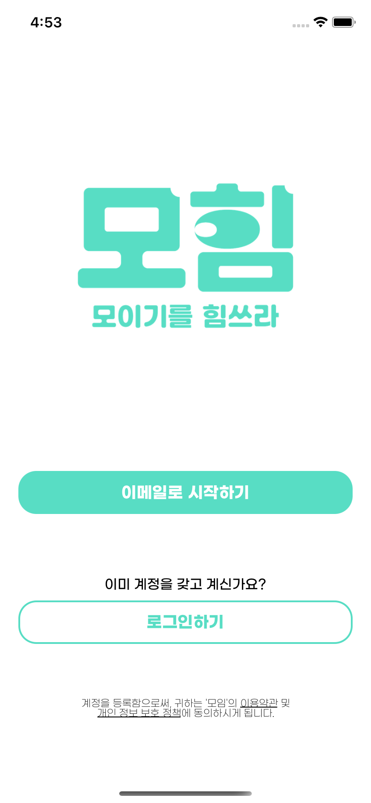
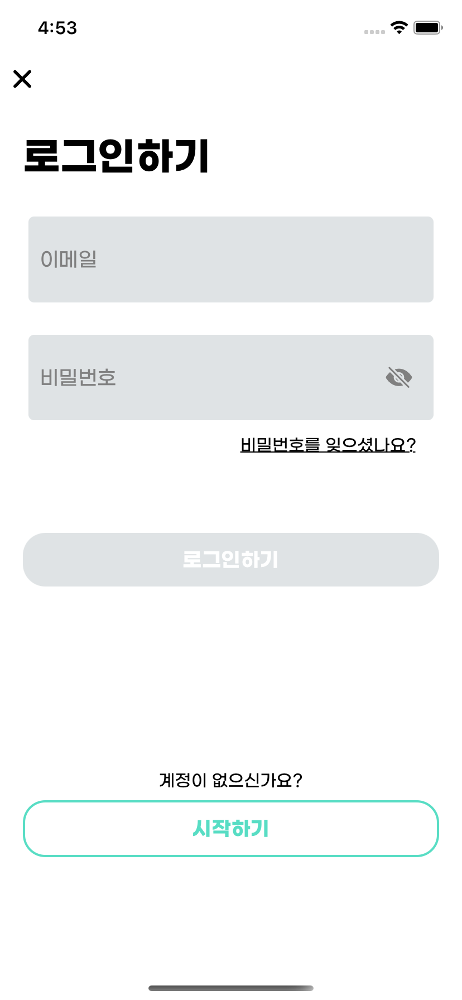
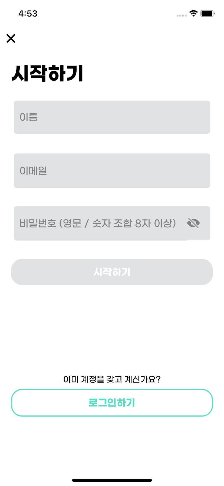
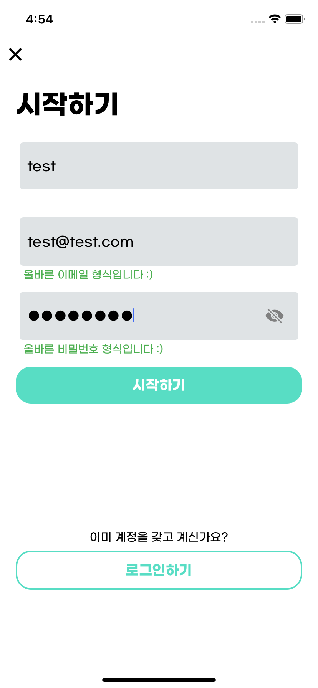
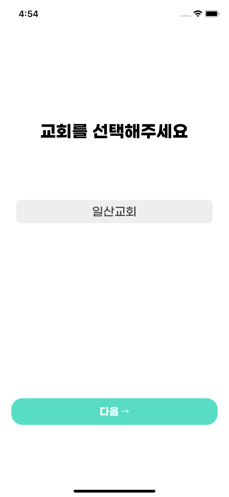
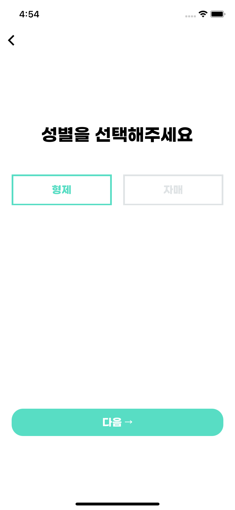
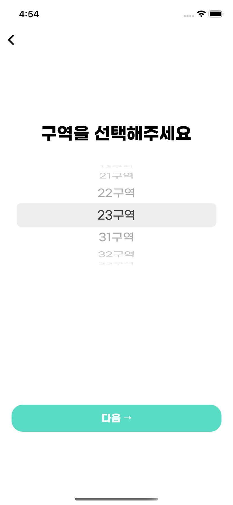
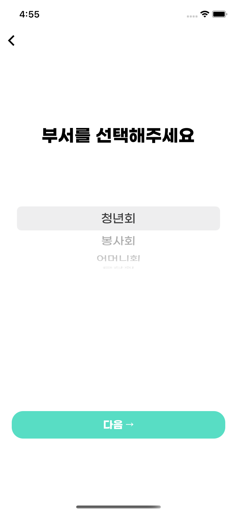
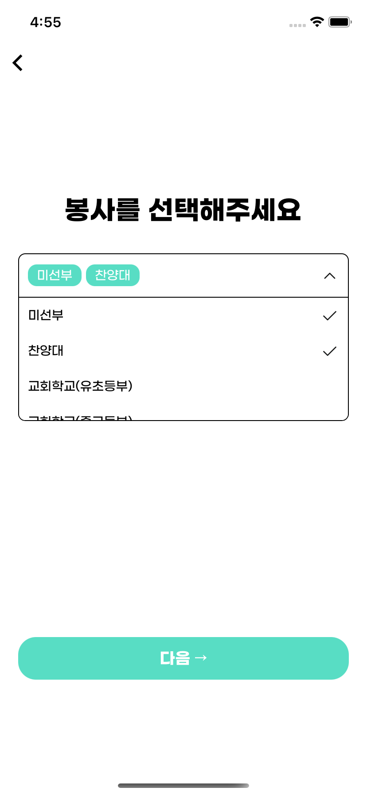
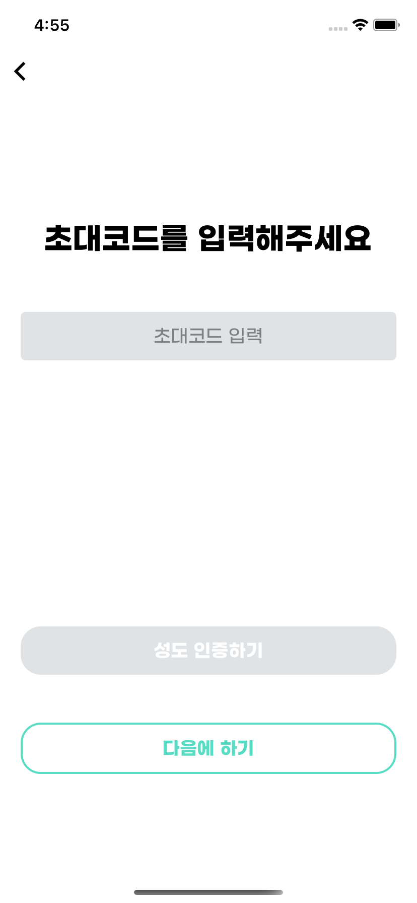
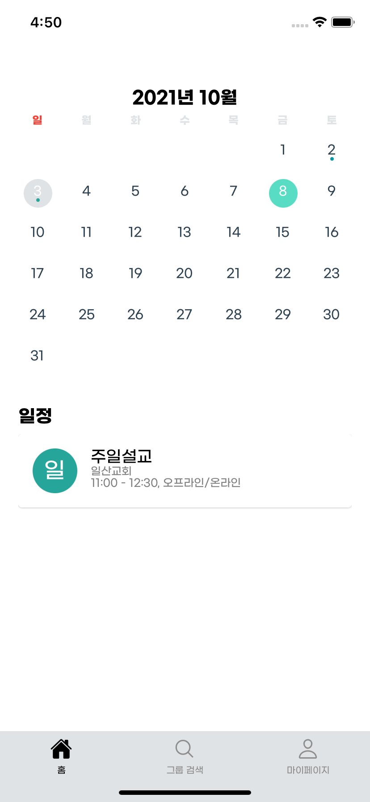
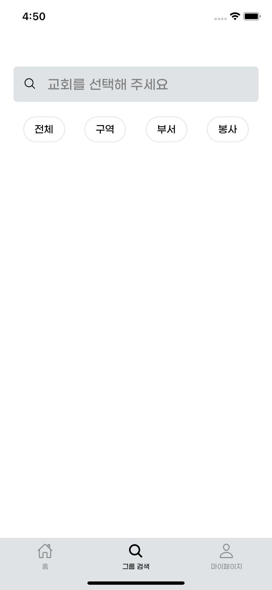
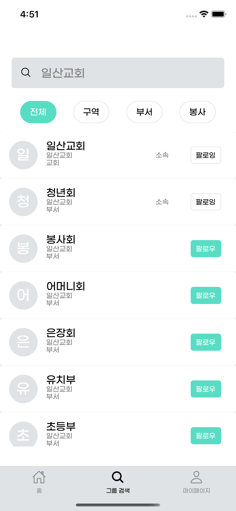
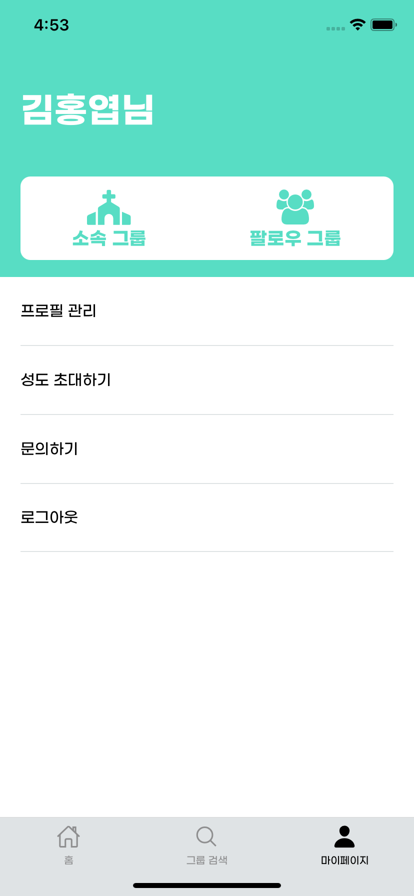
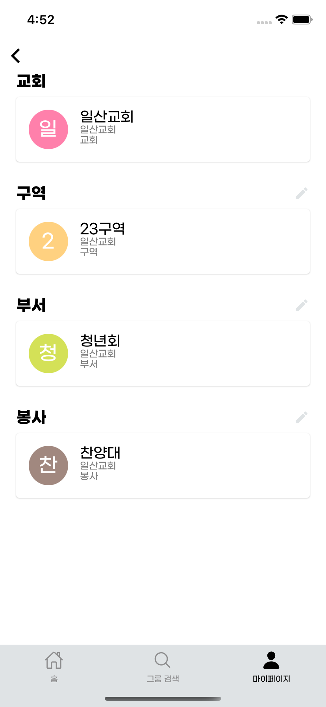
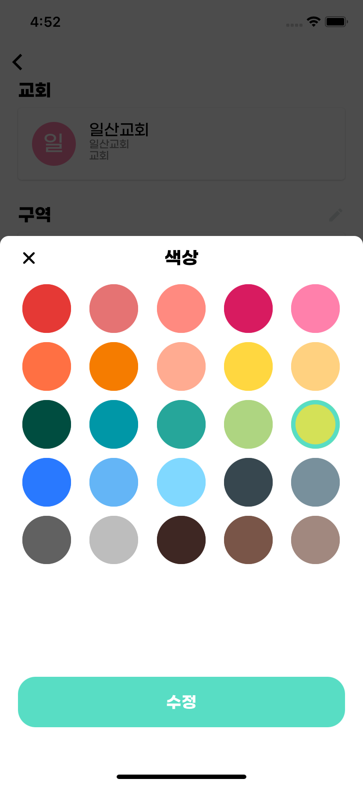
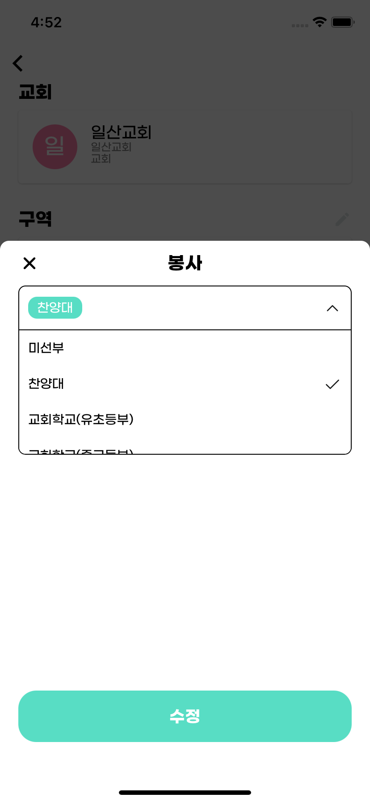
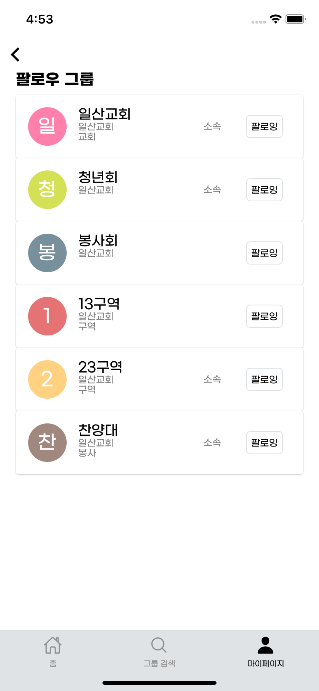

---

## 데모 영상

